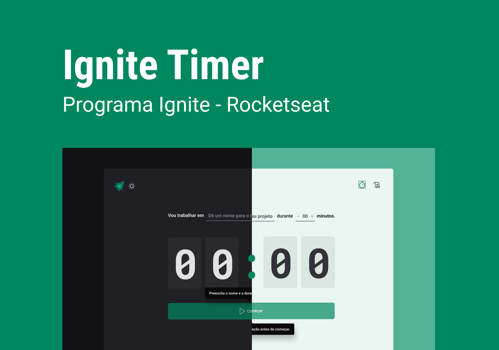
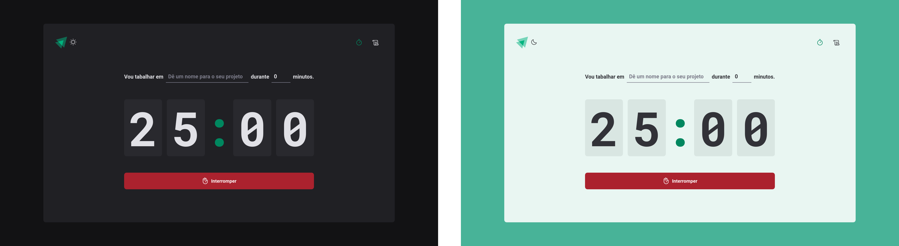
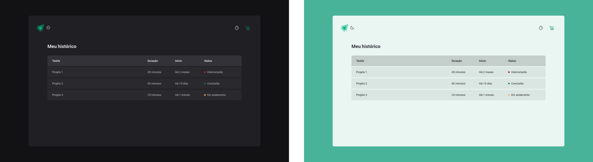

<h1 align="center">


</h1>

<p align="center">
  Timer - Cronômetro de tempo para suas atividades com painel de resultado 📰🚀
  <br>
  <br>

  <a href="https://rocketseat.com.br">
    
  </a>

  <a href="www.linkedin.com/in/rhalfoliveira">
    
  </a>

  <a href="https://github.com/qwwerty/ig.news/commits/master">
    
  </a>

</p>

---

<p align="center">
  <a href="#dart-sobre">Sobre</a> &#xa0; | &#xa0; 
  <a href="#rocket-tecnologias">Tecnologias</a> &#xa0; | &#xa0;
  <a href="#white_check_mark-requerimentos">Requerimentos</a> &#xa0; | &#xa0;
  <a href="#checkered_flag-começando">Começando</a> &#xa0; &#xa0; | &#xa0;
  <a href="#framed_picture-imagens">Imagens</a> &#xa0; &#xa0;
</p>

<br>

## :dart: Sobre ##

O objetivo é inciar uma tarefa aonde você tem um determinado tempo de concentração para fazer determinado projeto, 
semelhante a técnica do pomodoro


## :rocket: Tecnologias ##

As seguintes tecnologias foram utilizadas no projeto:

- [Vite Js](https://vitejs.dev/)
- [React Js](https://reactjs.org/)
- [Typescript](https://www.typescriptlang.org/)
- [Styled-components](https://styled-components.com/)
- [Phosphor Icons](https://phosphoricons.com/)
- [Redux](https://redux.js.org/)
- [React hook form](https://react-hook-form.com/)
- [Date-fns](https://date-fns.org/)
- [Zod](https://github.com/colinhacks/zod)
- [Immer](https://github.com/immerjs/immer)
- [Eslint](https://eslint.org/)

## :white_check_mark: Requerimentos ##

- [Node](https://nodejs.org/en/)
- [Npm](https://www.npmjs.com/)
- [Yarn](https://yarnpkg.com/lang/en/)

## :checkered_flag: Começando ##

```bash
# Clone this project
$ git clone https://github.com/qwwerty/timer

# Access
$ cd timer

# Install dependencies
$ yarn install

# Run the project
$ yarn dev

# The server will initialize in the <http://localhost:3000>
```
## :framed_picture: Imagens ##

<p align="center">
    
</p>

<p align="center">
    
</p>

<p align="center">
    
</p>


